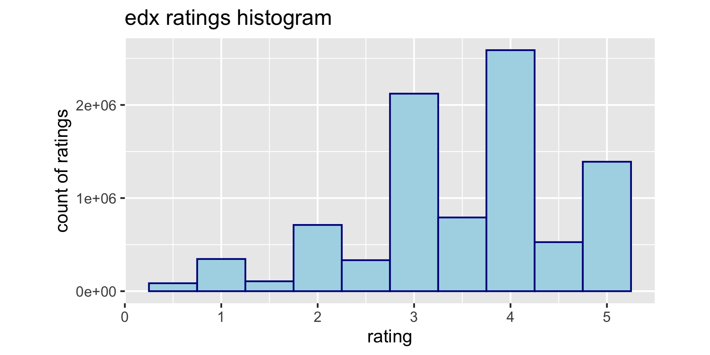
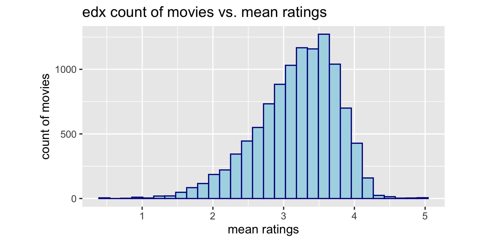
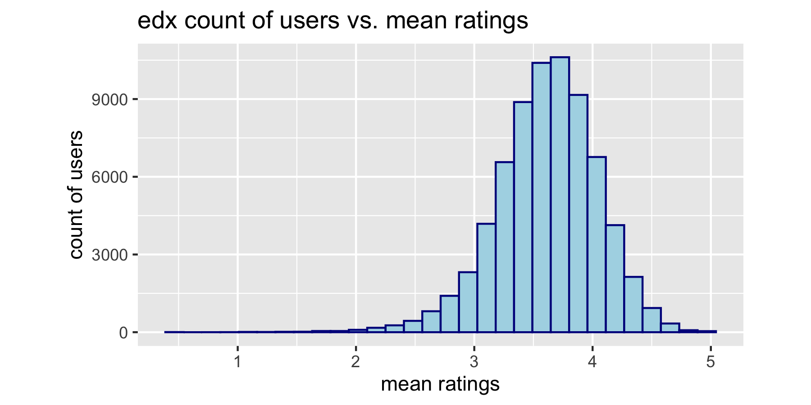
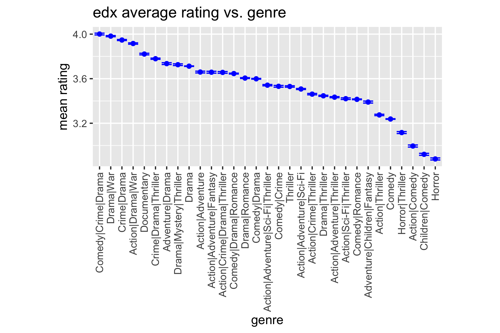
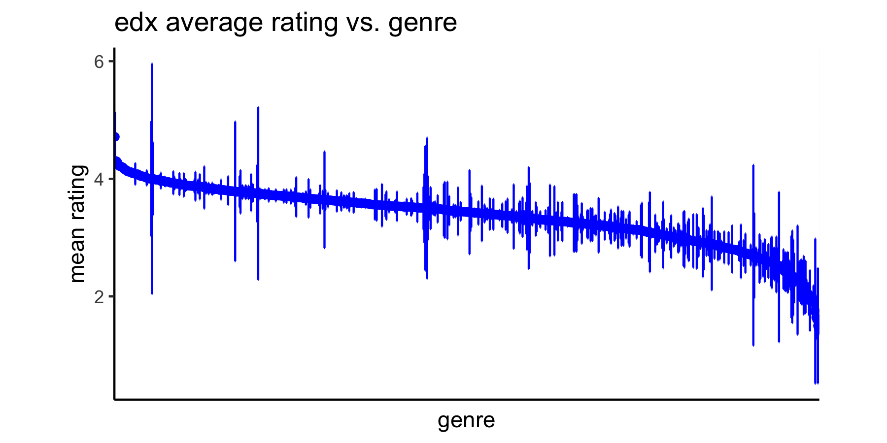
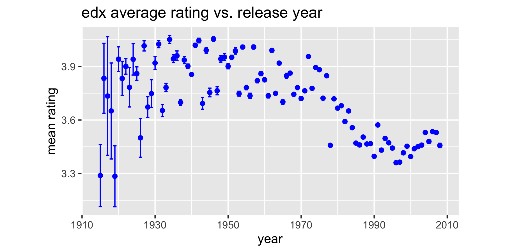
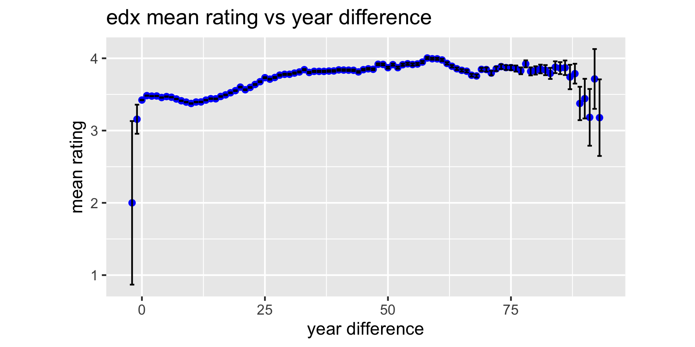
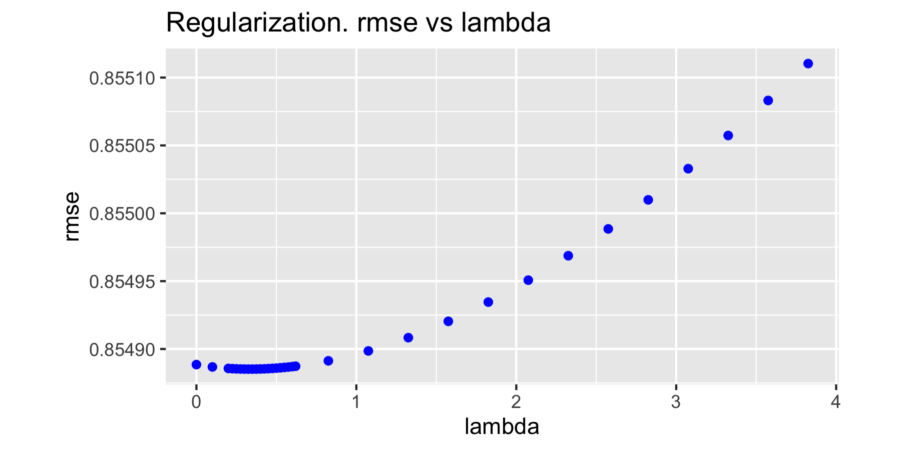

```{r setup, include=FALSE}
knitr::opts_chunk$set(echo = TRUE)
if(!require(tidyverse)) install.packages("tidyverse", 
                                         repos = "http://cran.us.r-project.org")
```

```{r, echo=FALSE, warning=FALSE}
# Include saved data from running MovieLens.R code
load(file="data/movielens_exploration.rda")
load(file="data/movielens_analysis.rda")
load(file="data/movielens_evaluation.rda")
```

# Executive summary

I have submitted this report as part of the requirements for the HarvardX 
PH125.9X Capstone course (Spring 2021). It explains how I built a recommender system to
predict the ratings users gave to movies in the MovieLens data set.

The goal of the project was an RMSE (root mean square error) of less than 
`r rmse_target`. The final RMSE I achieved was `r rmse_final` (lower than target), with clipping reducing the RMSE still further to `r rmse_clipped`.

This is a large data set, so the computational burden is high. To find a
reasonable result with available computing resources, I used a linear
modeling method and considered the following features:

* Movie effects

* User effects

* Genre effects (+)

* Movie release year effects (+)

* Duration between movie release year and movie review year (+)

I also considered review date but rejected it as a feature because 
it offered too little predictive power. To avoid overfitting, I used regularization. The features marked (+) are not covered in the course materials and are novel.

# Introduction

## Recommender systems

The goal of recommender systems is clear: predict the ratings or choice a user would make and recommend that choice to them. For example, make a recommendation of a jacket size and style based on a user's prior clothing purchases [Winecoff]. 

Recommender systems are widely used by internet companies, covering everything 
from movie recommendations [Gomez-Uribe], to music [Jacobson], to clothing fashion and fit [Winecoff]. They've become so commercially important, there's at least one conference series 
dedicated to them ([ACM Conference Series on Recommender Systems ](https://recsys.acm.org/)) and there are multiple books explaining how to build them 
(e.g. [Schrange], [Aggarwal], [Ricci]). 

## The project

The aim of this project was to build a recommender system based on a subset of the MovieLens movie review data. The goal of the recommender systems was to predict users' ratings of movies based on features in the data, for example, movie IDs, user IDs, genres, review times etc.

The MovieLens data was collected as part of the social computing research work at the [University of Minnesota](https://grouplens.org/) and is available from the [movielens site](https://grouplens.org/datasets/movielens/). The data contains numeric reviews for movies by reviewer and has other fields such as the movie title, movie genre, and review timestamp. 

## Limitations

The main project limitation was computational power. Commercial recommender systems 
typically use cloud computing clusters [Sun], that are both time 
consuming and expensive to setup and run - which rules them out for this 
project. I have access to a 2018 high-spec Mac Book Pro, which I used for this project. Given
this limitation, I choose to use less computationally demanding methods, 
specifically, linear modeling. The final project takes `r script_duration` to run,
the majority of which is consumed in regularization.

As required by the project instructions, this project uses the 10 million review subset. The full dataset has 27 million ratings. It's quite possible that other algorithms may give better results for the full dataset than those used here.

# Methods and analysis

## Data cleaning, test, train, and holdout data 

The MovieLens data I used for this project consists of 10 million reviews. I found no missing (NA) fields. I added data quality checks on users, movies, and genres to ensure consistency between runs. I added several new fields to the data when it was loaded, including review week, release year, and release review. I'll describe these fields later in this report.

I partitioned the loaded data into two groups using randomization (with a seed of 1):

* edx - 90% of the data. This data was used for training and regularization. *All* of the results in the 'Exploratory data analysis', 'Model building and training', and 'Regularization' sections of this report use this data *only*. 

* validation - 10% of the data. This is a holdout data set and was *only* used for the final model evaluation. The only section in this report that uses this data is the 'Final results' section.

For model development and testing, I partitioned the edx group into two sub-groups (again using randomization and a seed of 1):

* train - 90% of the data - used for training algorithms.

* test - 10% of the data - used for testing the trained algorithms.

This process will result in some users and movies appearing in the validation set but not in the edx set (similarly for the train and test sets). To prevent this happening, I add 'missing' users and movies back to the edx and train data sets. This gives a split that isn't quite 90%:10% but it's necessary for the modeling process to work.

## Exploratory data analysis

The edx data is a random subset of the full data set, which means exploratory analysis on the edx data set will be representative of the data set as a whole.

A view of the head of the edx data frame shows the following fields:

```{r, echo=FALSE, warning=FALSE}
# MovieLens data set is in Tidy Format
edx_original_head %>%   
  knitr::kable()
```

Note the movie release year is coded into the title and is always the last part of the title. The timestamp field is the UNIX-formatted timestamp when the user submitted their movie review. The genres field contains multiple values separated by a '|' character. Although there are six fields in the data set, the fact the movie title includes the release year suggests I should create a seventh field by extracting the release year.

The movie ratings are the outcomes I want to predict, so I'll explore ratings first. Here are the sorted unique ratings: 

`r edx_unique_ratings`

Note the range of values (0.5 to 5) and the steps (0.5); a rating of 2.75 for example, does not occur in this data set. 

I summarized the edx data as shown below:

```{r, echo=FALSE, warning=FALSE}
# MovieLens data set is in Tidy Format
edx_summary %>%   
  knitr::kable()
```

The summary shows there are a large number of users, movies, and ratings. This suggests the modeling computational burden will be high. The high average number of ratings per user and ratings per movie indicates I should look closely at the underlying distributions because there may be some structure relevant to modeling.

The most obvious distribution is the number of reviews by rating, shown in Figure 1 (below). The quantization and the upper and lower bounds are obvious, but it's also obvious that the distribution is *not* uniform, which suggests there are underlying factors that affect ratings. Note  the most common rating (mode) is 4 and that integer ratings are more common than half scores. I'll return to this topic in the 'Conclusion' section.



I show distribution of mean ratings by movie in Figure 2. This suggests a very strong movie effect on ratings and so it's a feature I need to include in my model. The distribution appears to be left-skewed compared to a normal distribution.



Figure 3 plots the user count vs. mean rating. Again, there's a very strong user effect on rating and as a result, I need to include it in my model. Note that it's an approximately normal distribution and its shape is different from the movie effect, suggesting movie and user effects have different dynamics.



Genres are a little harder to analyze because a movie can have multiple genres associated with it. If we look just at individual genres, we find these genres:

`r edx_unique_genres`

However, they can be combined in several ways. In the edx data, there are `r edx_distinct_genre_combos` unique values for the genres field. As a first approximation, it seems reasonable that combined genres (e.g 'Action | Adventure') may behave differently from the individual genres (e.g. 'Action', 'Adventure'). For now, I'm going to confine my analysis to combined genres, specifically, the contents of the genres column.

In Figure 4, I've plotted the mean rating and 95% confidence interval for all genres that have more than 50,000 reviews. I've ordered the data by decreasing mean rating. Obviously, there's a strong genre effect with a range of mean ratings from 4 down to about 2.8



This is just the top reviewed movies, but what about movies with less than 50,000 reviews? There are `r edx_distinct_genre_combos` genres, which means I can't display the genre names on the x axis. Figure 5 shows the full genre results (supressing genre names to fit the axis) and it's obvious there's a strong genres effect, but some genres have a wide confidence interval, which is something I'll come back to in the 'Conclusion' section.



The movie release year is another possible feature. I extracted release year from the title and plotted the mean rating by year (with 95% confidence interval) below (Figure 6). Ratings are dependent on release year, which is very clear after about 1970. Prior to 1970, the pattern is less obvious and I'll come back to this point in the 'Conclusion'. For now, I'll add movie release year as another model feature.



The final field in the data set is the review timestamp. To make timestamp data a little easier to analyze, I grouped it by week and plotted the mean rating for all movies reviewed in that week (Figure 7). Although there is an effect, it's smaller than the other effects I've seen so far. I decided to exclude it from my modeling work because of its low variation.


Although the timestamp of the review showed little variation, it's possible that the combination of release year *and* review time may be important. For example, older movies might get better reviews today because people may view them based on their pre-existing reputation. I calculated a feature called review_release which is $(year \ of \ review) - (year \ of \ movie \ release)$ and plotted mean rating against review_release (Figure 8).



Note that there are a few cases where release_review (the year difference) is negative, suggesting the movie was reviewed before it was released. This does happen from time to time (a movie might be made available for early review in December but released to the public in January, and sometimes rough cuts are screened well before release to gauge audience reactions). For now, I'll leave these reviews in the data set. 

The chart shows that, as expected, older movies have better reviews. I will include this feature in my model.

Bringing all my results together, my analysis has suggested the following model features:

* movie

* user

* genres

* release_review (release year - review year)

* release year

My analysis also suggests that review timestamp, on its own, will not explain much ratings variation.

## Model approach

Investigating appropriate modeling approaches takes time. With a large data set and limited computational resources (no cloud cluster for example), I need to select a relatively straightforward model and work to reduce the computation time. I therefore chose a linear model and took advantage of some computational short-cuts.

Given my five features, my linear prediction model is:

\[
Y_{u,i} = \mu + b_i + b_u + \sum_{k=1}^K{x^k_{u,i} \beta_k \ + f(rr_{u,i}) +  f(ry_{u,i})+ \epsilon_{u,i}}
\]

where:

* $Y_{u,i}$ is the rating prediction for movie $i$ from user $u$.

* $\mu$ is the mean rating for all movies and all users.

* $\epsilon_{u,i}$ is the error (assuming a mean of zero). I'll come back to this in the "Conclusion" section.

* $b_i$ is the mean rating for movie i.

* $b_u$ is the mean rating for user u.

* $\sum_{k=1}^K{x^k_{u,i} \beta_k}$ where $x_{u,i}^k = 1$ if $g_{u,i}$ is genre $k$. This represents the mean genre rating for genre $k$. For brevity, I will label this term $b_g$. (+)

* $f(rr_{u,i})$ - where $f$ is a smooth function of $rr_{u,i}$. This represents the mean rating for my feature release review. Again for brevity, I will label this term $b_{rr}$. (+)

* $f(ry_{u,i})$ - where $f$ is a smooth function of $ry_{u,i}$. This represents the mean rating for the release year feature. I will label this term $b_{ry}$. (+)

(Items labeled (+) are not in the course work and are novel for this project.)

Using linear modeling for a data set this large is computationally expensive, there is however a a shortcut I can take. I can write the estimate of $b_i$ as: 

\[\hat b_i = \frac{1}{N}\sum^N_{i=1} {Y_{u,i} - \hat \mu}\]

which is cheaper and easier to compute than using linear modeling in the caret package. But it's not just $b_i$ I can calculate in this way, I can similarly calculate the other terms, for example:

\[\hat b_u = \frac{1}{N}\sum^N_{i=1} {Y_{u,i} - \hat \mu - \hat b_i}\]

My code is a straightforward implementation of this algorithm. For example, here's a code snippet to calculate the genres effect.

```{r, eval=FALSE, warning=FALSE, echo=TRUE}
# Genres
b_g <- train %>% 
  left_join(b_i, by='movieId') %>%
  left_join(b_u, by='userId') %>%
  group_by(genres) %>%
  summarize(b_g = mean(rating - mu - b_i - b_u), 
            .groups='keep')
predicted_ratings <- test %>% 
  left_join(b_i, by='movieId') %>%
  left_join(b_u, by='userId') %>%
  left_join(b_g, by='genres') %>%
  mutate(pred = mu + b_i + b_u + b_g) %>%
  pull(pred)
rmse_genres = RMSE(test$rating, predicted_ratings)
model_scores <- rbind(scores, c("Genres", rmse_genres))
```

I'll use the loss function RMSE as my metric of success. RMSE is defined by the function \[RMSE = \sqrt{\frac{1}{N}\sum_{u,i}{(\hat y_{u,i} - y_{u,i})^2}}\] where $N$ is the number of recommendations, $\hat y_{u,i}$ is the predicted rating and $y_{u,i}$ is the actual rating. This is the course mandated measure.

If this approach is valid, we would expect to see the RMSE decrease as we build the model up from its components parts.

# Results

## Training results

I modeled the data in six stages using the train data subset:

* Mean only model

* Mean and movie effects

* Mean, movie effects, and user effects

* Mean, movie effects, user effects, and genre

* Mean, movie effects, user effects, genre, and release review effects.

* Mean, movie effects, user effects, genre, release review, and release year effects.

At each stage, I calculated the RMSE using the train and test subset of the edx data set. 

Here are the RMSE result for each stage of the model building process.

```{r, echo=FALSE, warning=FALSE}
# model_score table - results of each stage of the model
model_scores %>%   
  knitr::kable()
```

As expected, adding more features decreases RMSE, taking me below the course target of `r rmse_target`.

My model performance is problematic; the results show a decreasing effect on RMSE of adding more features. The first two features reduced the RMSE by 11% and 9%, then adding more features reduced the improvement by less than 1%. As each feature requires more computational time, this suggests it could become too computationally expensive to reduce the RMSE beyond some point. I will comment more on this in the 'Conclusion' section.

To avoid overfitting, I need to regularize my model prior to the final analysis.

## Regularization

Regularization means choosing a penalty term to constrain effect size variability. My penalty term is $\lambda$ and I select it by minimizing this function using cross validation:

\[
\sum_{u,i} \left(y_{u,i} - \mu - b_i - b_u - b_g - b_{rr} - b_{ry}\right)^2 + 
\lambda \left(\sum_{i} b_i^2 + \sum_{u} b_u^2 + \sum_{g} b_g^2 + \sum_{rr} b_{rr}^2 + \sum_{ry} b_{ry}^2 \right)
\]

Regularization is computationally expensive; to find a minimum $\lambda$ means varying lambda to minimize RMSE. There are various computational methods to do this, for example, the well-known Newton-Raphson process, but for now, I'll vary the lambda step size manually, with smaller steps around the minima and larger steps elsewhere.

Here's a code snipped to show how I implemented the logic.

```{r, eval=FALSE, warning=FALSE, echo=TRUE}
lambdas <- sort(c(seq(0,     0.1, 0.1),
                  seq(0.2,   0.6, 0.025), 
                  seq(0.62,  0.8, 0.2),
                  seq(0.825, 4,   0.25)))

# Function to apply lambdas to regularization
rmses_regularization <- sapply(lambdas, function(lambda) {
  
  mu <- mean(train$rating)
  
  # ... Code removed for clarity ...
  
  # Release year
  b_ry <- train %>% 
    left_join(b_i, by='movieId') %>%
    left_join(b_u, by='userId') %>%
    left_join(b_g, by='genres') %>%
    left_join(b_rr, by='review_release') %>%
    group_by(release_year) %>%
    summarize(b_ry = sum(rating - mu - b_i - b_u - b_g - b_rr)/(n() + lambda), 
              .groups='keep')
  
  # Predicted rating
  predicted_ratings <- test %>% 
    left_join(b_i, by='movieId') %>%
    left_join(b_u, by='userId') %>%
    left_join(b_g, by='genres') %>%
    left_join(b_rr, by='review_release') %>%
    left_join(b_ry, by='release_year') %>%
    mutate(pred = mu + b_i + b_u + b_g + b_rr + b_ry) %>%
    pull(pred)
 
  RMSE(test$rating, predicted_ratings)
})
```

Figure 9 is a plot of RMSE vs. lambda. The minimal lambda from the chart is `r lambda`.



## Final results

The final stage is using the entire edx data to train the model, using the lambda value previously obtained, and using the validation (holdout) data to calculate the final RMSE. 

The final RMSE value I obtain is `r rmse_final`, which is less than the course target of `r rmse_target`.

A closer look at the final rating predictions shows there are ratings <0.5 and >5, which are below and above the range of ratings I found earlier. I can 'clip' ratings to a minimum of 0.5 and a maximum of 5. Unsurprisingly, clipping reduces the RMSE still further to `r rmse_clipped`.

# Conclusion

Although the final results are better than the course target, more work could reduce the RMSE further.

As I pointed out earlier, ratings are quantized and the number of half star ratings is less than the number of whole star ratings. It may be worth investigating whether different factors drive full and half star ratings, for example, some users may rate on full stars alone. This might be a case where k-means clustering could identify different clusters of reviewers.

When modeling genres, I considered *all* genres for a movie. But there may be specific genre effects, for example "Comedy" movies might be more highly reviewed than 'Western' movies. There may well also be an interaction between genre and year, for example, there are fewer 'Western' movies produced now than there were in the 1940's. As chart 5 showed, there are some genres that have a high confidence interval, we might expect our rating to be less accurate in these cases and maybe some conditional logic might be appropriate. A random forest approach may be useful here because of the branching logic.

The release year chart (Figure 6) showed little variation before about 1970. Because of the conditional logic, a random forest approach might work well.

My linear predictive model had a 'error noise' term $\epsilon$ with a mean of zero. But it might not be the case that this is an appropriate error model; there may be a bias in the noise and of course there are other (non-normal) error models (see for example [Honda]). It might be worth considering error models that have other properties.

The first two features significantly reduced RMSE, but adding more features had a marginal effect on performance. There could be several reasons for this:

* The MovieLens data has insufficient structure and too much randomness to reduce the RMSE further. The Netflix results suggest further improvement is possible, but it may be there's an irreducible floor for RMSE results.

* A linear model might not be the best approach for further RMSE reduction. It may well be that the underlying system is highly non-linear for example.

* I may have missed key features. The underlying MovieLens data set has more features than the data set I used for this work. It's possible that there's something in this additional data, or the existing data, that would provide better features.

One way forward is to build an ensemble model, combining different modeling approaches. Although an ensemble model is attractive, in practice the computational burden may be too high for very large data sets. More generally, for a large-scale system, the computational cost must be borne in mind, which suggests we should favor computational cheaper algorithms as the way forward.

# References

[Aggarwal] Charu C. Aggarwal, Recommender Systems: The Textbook, Springer, 2016

[Gomez-Uribe] Carlos A. Gomez-Uribe and Neil Hunt. 2016. The Netflix Recommender System: Algorithms, Business Value, and Innovation. ACM Trans. Manage. Inf. Syst. 6, 4, Article 13 (January 2016)

[Honda] Testing the Error Components Model with Non-Normal Disturbances, Yuzo Honda, The Review of Economic Studies, Volume 52, Issue 4, October 1985, Pages 681–690

[Jacobson] Kurt Jacobson, Vidhya Murali, Edward Newett, Brian Whitman, and Romain Yon. 2016. Music Personalization at Spotify. In Proceedings of the 10th ACM Conference on Recommender Systems (RecSys '16). Association for Computing Machinery, New York, NY, USA, 373

[Ricci] Francesco Ricci, Lior Rokach, Bracha Shapira, Recommender Systems Handbook, Springer, 2015  

[Schrange] Michael Schrange, Recommendation Engines, MIT Press, 2020

[Winecoff] Amy A. Winecoff, Florin Brasoveanu, Bryce Casavant, Pearce Washabaugh, and Matthew Graham. 2019. Users in the loop: a psychologically-informed approach to similar item retrieval. In Proceedings of the 13th ACM Conference on Recommender Systems (RecSys '19). Association for Computing Machinery, New York, NY, USA, 52–59